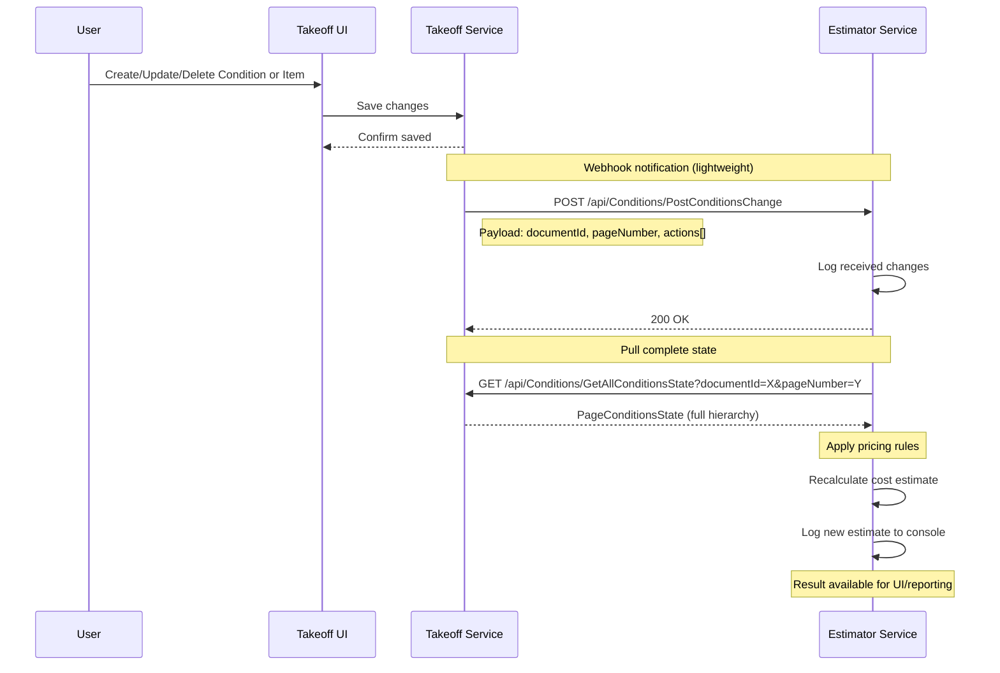
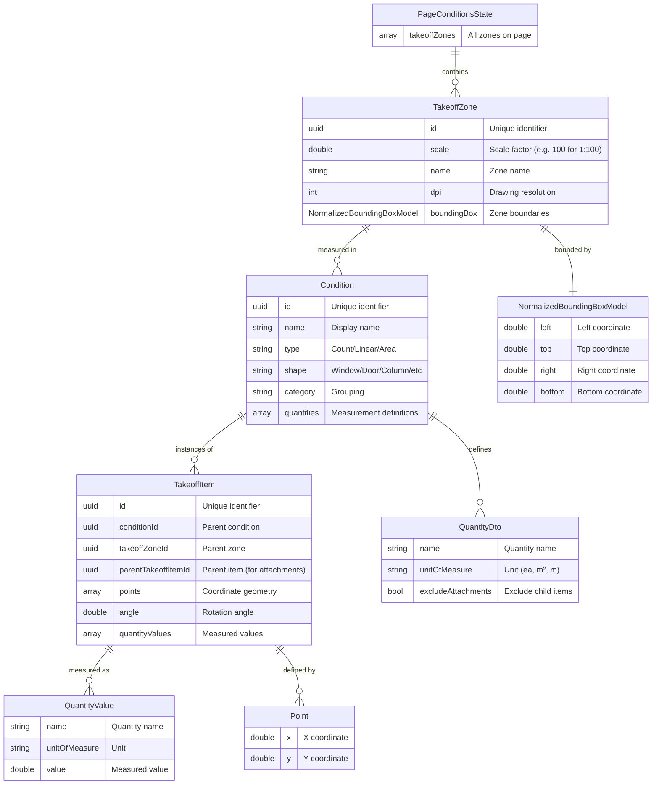

# Интеграция Takeoff ↔ Estimator

## Обзор

Этот пакет обеспечивает двунаправленную интеграцию между двумя сервисами AEC (Архитектура, Инженерия, Строительство):

**Сервис Takeoff** — это система измерений на основе компьютерного зрения, которая позволяет пользователям выполнять точные измерения на строительных чертежах. Пользователи могут отмечать окна, двери, стены и другие строительные элементы на PDF/CAD чертежах, а система автоматически рассчитывает количества (подсчет, площади, линейные размеры) на основе масштаба чертежа.

**Сервис Estimator** — это система оценки стоимости, которая получает данные измерений от Takeoff и рассчитывает стоимость проекта, применяя правила ценообразования и ставки материалов к измеренным количествам.

Поток интеграции основан на **webhook-архитектуре с механизмом pull**: когда пользователи изменяют измерения в Takeoff, он отправляет облегченное уведомление в Estimator, который затем запрашивает полное текущее состояние и пересчитывает смету стоимости. Этот подход гарантирует, что Estimator всегда работает с актуальными данными, при этом минимизируя размер полезной нагрузки в webhook.

## Архитектура

### Поток интеграции

Следующая диаграмма последовательности показывает полный поток интеграции:



**Ключевые моменты:**
1. **Действие пользователя**: Пользователь изменяет измерения в Takeoff UI (добавляет окно, обновляет стену, удаляет дверь и т.д.)
2. **Триггер webhook**: Takeoff отправляет POST-запрос с деталями изменения (что изменилось, но не полное состояние)
3. **Синхронизация состояния**: Estimator немедленно запрашивает полное текущее состояние у Takeoff
4. **Расчет стоимости**: Estimator применяет правила ценообразования к обновленным измерениям и записывает результаты в лог

### Иерархия модели данных

Модель данных следует иерархической структуре от областей чертежа до отдельных измерений:



**Пример иерархии:**
- **PageConditionsState**: Чертеж плана этажа, страница 1
  - **TakeoffZone**: "Floor Plan - Scale 1:100" (DPI: 300, scale: 100)
    - **Condition**: "Standard Window 1200x1500" (Type: Count, Shape: Window)
      - **TakeoffItem**: Экземпляр окна в координатах (150.5, 200.3)
        - **QuantityValue**: Count = 1 ea
        - **QuantityValue**: Area = 1.8 m²

## Конечные точки API

### Реализовано в сервисе Takeoff

#### `GET /api/Conditions/GetAllConditionsState`

Возвращает полное текущее состояние всех измерений для конкретной страницы документа.

**Параметры:**
- `documentId` (UUID, обязательный): Уникальный идентификатор строительного документа/чертежа
- `pageNumber` (integer, обязательный): Номер страницы в документе (начиная с 1)

**Возвращает:** `PageConditionsState`
- Полная иерархия TakeoffZones → Conditions → TakeoffItems
- Все значения измерений (подсчеты, площади, линейные размеры)
- Координатная геометрия для всех элементов

**Использование:** Вызывается Estimator после получения уведомления webhook для получения полного текущего состояния.

**Пример:**
```
GET /api/Conditions/GetAllConditionsState?documentId=550e8400-e29b-41d4-a716-446655440000&pageNumber=1
```

---

### Реализовано в сервисе Estimator

#### `POST /api/Conditions/PostConditionsChange`

Конечная точка webhook для получения уведомлений об изменениях в измерениях Takeoff.

**Тело запроса:** `ConditionsChange`
- `documentId` (UUID): Документ, в котором произошли изменения
- `pageNumber` (integer): Номер страницы, на которой произошли изменения
- `actions` (array): Список действий Create/Update/Delete

**Ответ:** `200 OK` при успешном получении уведомления

**Использование:** Вызывается Takeoff всякий раз, когда пользователь создает, обновляет или удаляет условия или элементы takeoff.

**Пример:**
```json
POST /api/Conditions/PostConditionsChange
Content-Type: application/json

{
  "documentId": "550e8400-e29b-41d4-a716-446655440000",
  "pageNumber": 1,
  "actions": [
    {
      "orderNumber": 1,
      "actionName": "Create",
      "entityType": "Condition",
      "condition": { ... }
    }
  ]
}
```

## Быстрый старт

### Вариант A: Docker (Рекомендуется)

**Требования:** Docker и Docker Compose

**Запуск обоих сервисов одной командой:**
```bash
docker-compose up
```

**Проверка:**
- Takeoff: http://localhost:8000/docs
- Estimator: http://localhost:8001/docs

**Остановка:**
```bash
docker-compose down
```

### Вариант B: Локальный запуск (Python)

**Требования:** Python 3.9+

**Terminal 1 - Takeoff Service:**
```bash
cd takeoff_service
pip install -r requirements.txt
python main.py
```
→ Running on http://localhost:8000 | Swagger: http://localhost:8000/docs

**Terminal 2 - Estimator Service:**
```bash
cd estimator_service
pip install -r requirements.txt
python main.py
```
→ Running on http://localhost:8001 | Swagger: http://localhost:8001/docs

### Тестирование интеграции

**Swagger UI (проще всего):**
1. Open http://localhost:8001/docs
2. Find `POST /api/Conditions/PostConditionsChange`
3. Click "Try it out" → paste `examples/sample_webhook.json`
4. Click "Execute"
5. Watch logs (docker-compose: в консоли | Python: в обоих терминалах)

**Using cURL:**
```bash
curl -X POST http://localhost:8001/api/Conditions/PostConditionsChange \
  -H "Content-Type: application/json" \
  -d @examples/sample_webhook.json
```

## Ожидаемый вывод в консоль

**Терминал сервиса Estimator:**
```
============================================================
📥 WEBHOOK RECEIVED: PostConditionsChange
============================================================
   Document ID: 550e8400-e29b-41d4-a716-446655440000
   Page Number: 1
   Actions: 1 change(s)
     [1] Create Condition (N/A)
✅ Webhook accepted. Starting background processing...
📤 Fetching full state from Takeoff...
   URL: http://localhost:8000/api/Conditions/GetAllConditionsState
   Params: documentId=550e8400-e29b-41d4-a716-446655440000, pageNumber=1
✅ Retrieved state: 1 zone(s), 3 condition(s), 5 item(s)
💰 Calculating cost estimate...
🔍 Starting cost calculation...
  📍 Processing zone: First Floor Plan
    🏷️  Standard Window (Type: Count, Rate: $200.0/EA)
      ✓ Window #1 - Living Room: 1.0 EA × $200.0 = $200.00
      ✓ Window #2 - Bedroom: 1.0 EA × $200.0 = $200.00
    🏷️  Interior Door (Type: Count, Rate: $300.0/EA)
      ✓ Door #1 - Main Entrance: 1.0 EA × $300.0 = $300.00
    🏷️  Exterior Wall (Type: Area, Rate: $50.0/SQ.M)
      ✓ Wall #1 - North Wall: 15.5 SQ.M × $50.0 = $775.00
      ✓ Wall #2 - East Wall: 12.4 SQ.M × $50.0 = $620.00
✅ Calculation complete: 5 items processed
============================================================
💵 ESTIMATED COST: $2,095.00
============================================================
```

**Терминал сервиса Takeoff:**
```
📤 GET /api/Conditions/GetAllConditionsState - documentId=550e8400-e29b-41d4-a716-446655440000, pageNumber=1
✅ Returning state: 1 zone(s), 3 condition(s), 5 item(s)
INFO:     127.0.0.1:xxxxx - "GET /api/Conditions/GetAllConditionsState?documentId=550e8400-e29b-41d4-a716-446655440000&pageNumber=1 HTTP/1.1" 200 OK
```

**Что происходит:**
1. Webhook отправлен в Estimator
2. Estimator запрашивает состояние у Takeoff
3. Стоимость рассчитана: 2 окна ($400) + 1 дверь ($300) + 2 стены ($1,395) = **$2,095**

## Структура проекта

```
api_integration_package/
├── README.md                      # Этот файл
├── openapi_corrected.yaml         # Исправленная OpenAPI спецификация
├── integration_flow.mmd           # Диаграмма последовательности (Mermaid)
├── data_model.mmd                 # Диаграмма модели данных (Mermaid)
├── examples/
│   └── sample_webhook.json        # Пример полезной нагрузки webhook
├── takeoff_service/
│   ├── main.py                    # FastAPI приложение (порт 8000)
│   ├── models.py                  # Pydantic модели
│   ├── mock_data.py               # Тестовые данные
│   └── requirements.txt
└── estimator_service/
    ├── main.py                    # FastAPI приложение (порт 8001)
    ├── models.py                  # Pydantic модели
    ├── pricing.py                 # Расчет стоимости
    └── requirements.txt
```

## Технические примечания

- **Данные в памяти**: Жестко заданные тестовые данные (без базы данных)
- **Только успешный сценарий**: Без аутентификации и обработки ошибок
- **Swagger UI**: Автоматически генерируется на конечных точках `/docs`
- **Логирование**: Консоль показывает полный поток

## Источники данных и тестовые данные

Этот демонстрационный пакет использует реалистичные тестовые данные для демонстрации:

**Структура данных (из OpenAPI спецификации):**
- Все схемы, имена полей и типы данных получены из предоставленной OpenAPI спецификации
- Модели включают: PageConditionsState, TakeoffZone, Condition, TakeoffItem, QuantityValue

**Тестовые значения (сгенерированы для демонстрации):**
- Конкретные значения данных (координаты, измерения, имена) были сгенерированы для представления реалистичных сценариев AEC
- Пример: зона "First Floor Plan", "Standard Window 1200x1500", координаты (150.5, 200.3)
- Тестовые данные определены в [takeoff_service/mock_data.py](takeoff_service/mock_data.py)

**Правила ценообразования (определены для демонстрации):**
- Цены за единицу были созданы для демонстрации: Окна ($200/EA), Двери ($300/EA), Стены ($50/SQ.M)
- Логика ценообразования реализована в [estimator_service/pricing.py](estimator_service/pricing.py)
- Итоговый расчет ($2,095) вычисляется автоматически механизмом оценки стоимости

## Правила ценообразования

- Окна: $200 за единицу
- Двери: $300 за единицу
- Стены: $50 за квадратный метр