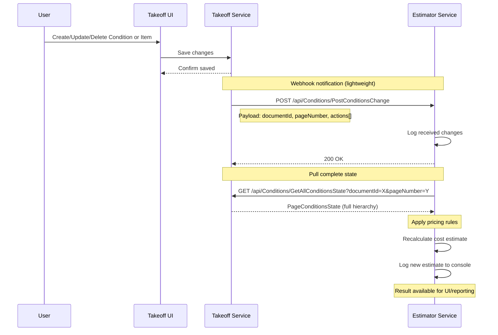
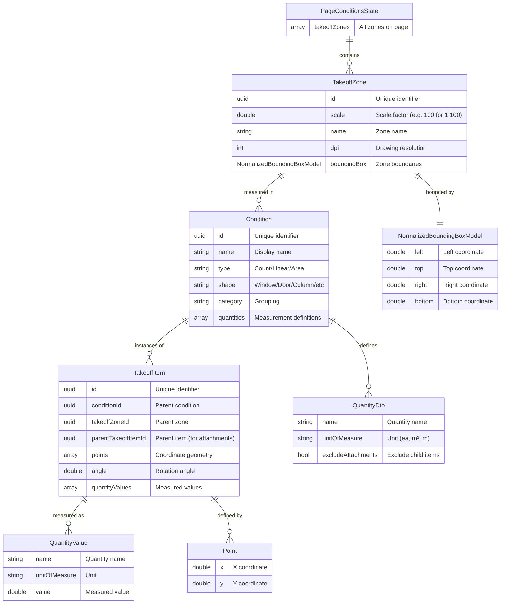

# Takeoff ↔ Estimator Integration Package

## Overview

This package provides a bidirectional integration between two AEC (Architecture, Engineering, Construction) services:

**Takeoff Service** is a computer vision-based measurement system that enables users to take precise measurements from construction drawings. Users can mark windows, doors, walls, and other construction elements on PDF/CAD drawings, and the system automatically calculates quantities (counts, areas, linear measurements) based on the drawing scale.

**Estimator Service** is a cost estimation system that receives measurement data from Takeoff and calculates project costs by applying pricing rules and material rates to the measured quantities.

The integration flow is **webhook-based with pull architecture**: when users modify measurements in Takeoff, it sends a lightweight notification to Estimator, which then requests the complete current state and recalculates the cost estimate. This approach ensures Estimator always works with the latest data while minimizing payload sizes in webhooks.

## Architecture

### Integration Flow

The following sequence diagram shows the complete integration flow:



**Key Points:**
1. **User Action**: User modifies measurements in Takeoff UI (add window, update wall, delete door, etc.)
2. **Webhook Trigger**: Takeoff sends POST request with change details (what changed, but not full state)
3. **State Synchronization**: Estimator immediately requests full current state from Takeoff
4. **Cost Calculation**: Estimator applies pricing rules to the updated measurements and logs results

### Data Model Hierarchy

The data model follows a hierarchical structure from drawing regions down to individual measurements:



**Example Hierarchy:**
- **PageConditionsState**: Floor plan drawing page 1
  - **TakeoffZone**: "Floor Plan - Scale 1:100" (DPI: 300, scale: 100)
    - **Condition**: "Standard Window 1200x1500" (Type: Count, Shape: Window)
      - **TakeoffItem**: Window instance at coordinates (150.5, 200.3)
        - **QuantityValue**: Count = 1 ea
        - **QuantityValue**: Area = 1.8 m²

## API Endpoints

### Takeoff Service Implements

#### `GET /api/Conditions/GetAllConditionsState`

Returns the complete current state of all measurements for a specific document page.

**Parameters:**
- `documentId` (UUID, required): Unique identifier of the construction document/drawing
- `pageNumber` (integer, required): Page number within the document (1-indexed)

**Returns:** `PageConditionsState`
- Complete hierarchy of TakeoffZones → Conditions → TakeoffItems
- All measurement values (counts, areas, linear dimensions)
- Coordinate geometry for all items

**Usage:** Called by Estimator after receiving a webhook notification to get the full current state.

**Example:**
```
GET /api/Conditions/GetAllConditionsState?documentId=550e8400-e29b-41d4-a716-446655440000&pageNumber=1
```

---

### Estimator Service Implements

#### `POST /api/Conditions/PostConditionsChange`

Webhook endpoint to receive notifications about changes in Takeoff measurements.

**Request Body:** `ConditionsChange`
- `documentId` (UUID): Document where changes occurred
- `pageNumber` (integer): Page number where changes occurred
- `actions` (array): List of Create/Update/Delete actions

**Response:** `200 OK` when notification is successfully received

**Usage:** Called by Takeoff whenever user creates, updates, or deletes conditions or takeoff items.

**Example:**
```json
POST /api/Conditions/PostConditionsChange
Content-Type: application/json

{
  "documentId": "550e8400-e29b-41d4-a716-446655440000",
  "pageNumber": 1,
  "actions": [
    {
      "orderNumber": 1,
      "actionName": "Create",
      "entityType": "Condition",
      "condition": { ... }
    }
  ]
}
```

## Quick Start

### Option A: Docker (Рекомендуется)

**Требования:** Docker и Docker Compose

**Запуск обоих сервисов одной командой:**
```bash
docker-compose up
```

**Проверка:**
- Takeoff: http://localhost:8000/docs
- Estimator: http://localhost:8001/docs

**Остановка:**
```bash
docker-compose down
```

### Option B: Локальный запуск (Python)

**Требования:** Python 3.9+

**Terminal 1 - Takeoff Service:**
```bash
cd takeoff_service
pip install -r requirements.txt
python main.py
```
→ Running on http://localhost:8000 | Swagger: http://localhost:8000/docs

**Terminal 2 - Estimator Service:**
```bash
cd estimator_service
pip install -r requirements.txt
python main.py
```
→ Running on http://localhost:8001 | Swagger: http://localhost:8001/docs

### Тестирование интеграции

**Swagger UI (проще всего):**
1. Open http://localhost:8001/docs
2. Find `POST /api/Conditions/PostConditionsChange`
3. Click "Try it out" → paste `examples/sample_webhook.json`
4. Click "Execute"
5. Watch logs (docker-compose: в консоли | Python: в обоих терминалах)

**Using cURL:**
```bash
curl -X POST http://localhost:8001/api/Conditions/PostConditionsChange \
  -H "Content-Type: application/json" \
  -d @examples/sample_webhook.json
```

## Expected Console Output

**Estimator Service Terminal:**
```
============================================================
📥 WEBHOOK RECEIVED: PostConditionsChange
============================================================
   Document ID: 550e8400-e29b-41d4-a716-446655440000
   Page Number: 1
   Actions: 1 change(s)
     [1] Create Condition (N/A)
✅ Webhook accepted. Starting background processing...
📤 Fetching full state from Takeoff...
   URL: http://localhost:8000/api/Conditions/GetAllConditionsState
   Params: documentId=550e8400-e29b-41d4-a716-446655440000, pageNumber=1
✅ Retrieved state: 1 zone(s), 3 condition(s), 5 item(s)
💰 Calculating cost estimate...
🔍 Starting cost calculation...
  📍 Processing zone: First Floor Plan
    🏷️  Standard Window (Type: Count, Rate: $200.0/EA)
      ✓ Window #1 - Living Room: 1.0 EA × $200.0 = $200.00
      ✓ Window #2 - Bedroom: 1.0 EA × $200.0 = $200.00
    🏷️  Interior Door (Type: Count, Rate: $300.0/EA)
      ✓ Door #1 - Main Entrance: 1.0 EA × $300.0 = $300.00
    🏷️  Exterior Wall (Type: Area, Rate: $50.0/SQ.M)
      ✓ Wall #1 - North Wall: 15.5 SQ.M × $50.0 = $775.00
      ✓ Wall #2 - East Wall: 12.4 SQ.M × $50.0 = $620.00
✅ Calculation complete: 5 items processed
============================================================
💵 ESTIMATED COST: $2,095.00
============================================================
```

**Takeoff Service Terminal:**
```
📤 GET /api/Conditions/GetAllConditionsState - documentId=550e8400-e29b-41d4-a716-446655440000, pageNumber=1
✅ Returning state: 1 zone(s), 3 condition(s), 5 item(s)
INFO:     127.0.0.1:xxxxx - "GET /api/Conditions/GetAllConditionsState?documentId=550e8400-e29b-41d4-a716-446655440000&pageNumber=1 HTTP/1.1" 200 OK
```

**What happens:**
1. Webhook sent to Estimator
2. Estimator fetches state from Takeoff
3. Cost calculated: 2 Windows ($400) + 1 Door ($300) + 2 Walls ($1,395) = **$2,095**

## Project Structure

```
api_integration_package/
├── README.md                      # This file
├── openapi_corrected.yaml         # Corrected OpenAPI specification
├── integration_flow.mmd           # Sequence diagram (Mermaid)
├── data_model.mmd                 # Data model diagram (Mermaid)
├── examples/
│   └── sample_webhook.json        # Example webhook payload
├── takeoff_service/
│   ├── main.py                    # FastAPI app (port 8000)
│   ├── models.py                  # Pydantic models
│   ├── mock_data.py               # Mock data
│   └── requirements.txt
└── estimator_service/
    ├── main.py                    # FastAPI app (port 8001)
    ├── models.py                  # Pydantic models
    ├── pricing.py                 # Cost calculation
    └── requirements.txt
```

## Technical Notes

- **In-Memory Data**: Hardcoded mock data (no database)
- **Happy Path Only**: No authentication or error handling
- **Swagger UI**: Auto-generated at `/docs` endpoints
- **Logging**: Console shows complete flow

## Data Sources & Mock Data

This demo package uses realistic mock data for demonstration purposes:

**Data Structure (from OpenAPI Specification):**
- All schemas, field names, and data types are derived from the provided OpenAPI specification
- Models include: PageConditionsState, TakeoffZone, Condition, TakeoffItem, QuantityValue

**Mock Values (generated for demo):**
- Concrete data values (coordinates, measurements, names) were generated to represent realistic AEC scenarios
- Example: "First Floor Plan" zone, "Standard Window 1200x1500", coordinates (150.5, 200.3)
- Mock data is defined in [takeoff_service/mock_data.py](takeoff_service/mock_data.py)

**Pricing Rules (defined for demo):**
- Unit prices were created for demonstration: Windows ($200/EA), Doors ($300/EA), Walls ($50/SQ.M)
- Pricing logic is implemented in [estimator_service/pricing.py](estimator_service/pricing.py)
- Final calculation ($2,095) is computed automatically by the cost estimation engine

## Pricing Rules

- Windows: $200 per unit
- Doors: $300 per unit
- Walls: $50 per square meter
